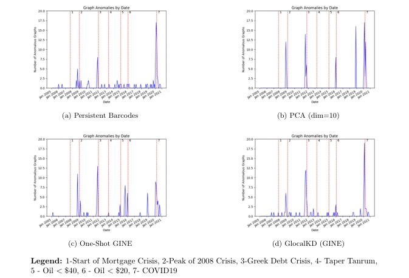

# Financial-Anomaly-Detection-for-the-Canadian-Market

**Project Description**: Financial Anomaly Detection for the Canadian Market 
**Principal Investigator**: Nicholas Meadows 
**Available at**: GitHub: njmead811/Financial-Anomaly-Detection-for-the-Canadian-Market; arXiv: 2604.02549.

## Business Motivation 

Stock market crashes, such as the October 1987 market crash, the 2008 financial crash, and more recently the financial crash caused by COVID19 are a source of considerable risk and profit for investors. Thus, understanding them theoretically and ultimately predicting them is of great importance and a source of theoretical research.

A recurring idea in the literature is that early warning signs of financial stress or market collapse can be understood as outliers or anomalies in the structure of financial time series, especially how correlations between stocks behave during periods of stress. 
These kinds of structural anomalies are also relevant to institutions that study credit risk, systemic risk, and portfolio‑level contagion, since shifts in market correlations often coincide with broader deterioration in credit conditions and correlated defaults.

## Methodology

- **Construct correlation matrices** — Construct correlation matrices for a sliding window of stock prices to capture how relationships between stocks change over time.

- **Interpret as weighted graphs** — Interpret correlation matrices as weighted graphs, where nodes are stocks and edges represent correlations.

- **Reformulate as graph anomaly detection** — Reformulate the problem as a graph anomaly detection task, using graph neural networks, topological data analysis and standard statistical baselines.

## Results

- **Major crises detected** — Both baseline and GNN methods successfully identified major financial crises, such as 2008–2009, the Greek Debt Crisis, and COVID‑19.

- **Improved detection of smaller events** — Smaller crises were more effectively detected using graph‑based methods as opposed to baseline methods.

## Visualization of Results

               **Figure 1:** Anomalies Detected by Different Methods (TSX-60)

## How to Reproduce the Experiments 

1. Run STOCKDATA.py to create correlation matrices for the stock prices
2. Run GraphAnomalyDetection.ipynb and TDAPCAAnomalyDetection to obtain the anomaly scores for the graphs according to each different method.
   The former computes the anomaly scores for the neural network methods, whereas the latter computes the anomaly scores
   for PCA/TDA methods.
4. Finally run EVALUATEDETECTOR.py to evaluate and visualize the results of each anomaly detection method.
5. The filenames must be slightly changed for the US versus Canada stocks, with details on how to do this contained in the commenting for each file. 
